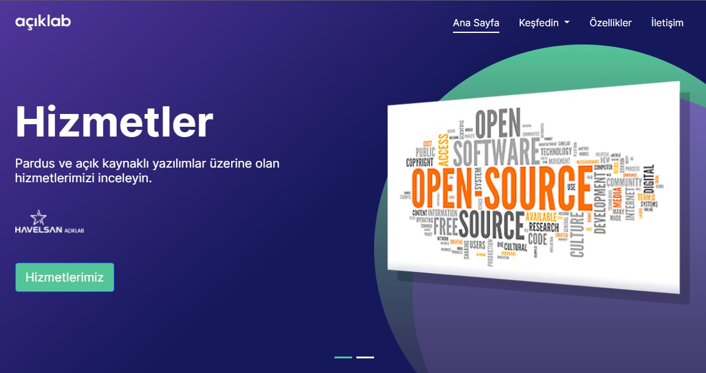

# AçıkLab Websitesi
Limanmys/Site reposundan forklanıp gerekli değişiklikler yapılmıştır.
Bilgilendirme açısından README üzerinde değişiklik yapılmamıştır.  

## README
Site: https://aciklab.org
Repository: https://github.com/aciklab/Site

#### İçerik:
1. [Github Actions Komutları](https://github.com/limanmys/Site/new/master?readme=1#1-github-actions-komutlar%C4%B1)
2. [Hugo'nun Yapısı](https://github.com/limanmys/Site/new/master?readme=1#2-hugonun-yap%C4%B1s%C4%B1)

## 1. Github Actions Komutları
> [Site](https://github.com/limanmys/Site)/[.github](https://github.com/limanmys/Site/tree/master/.github)/[workflows](https://github.com/limanmys/Site/tree/master/.github/workflows)/**main.yml**
### Hugo Versiyonu
Repository'de ki Hugo versiyonunu aşağıdaki **Github Actions** komutu ile kontrol ediliyor. Gerekli olan `.deb` paketi yoksa komuttaki linkten indiriyor. Buradaki linkleri değiştirerek Hugo'nun versiyonunu değiştirebiliriz. Fakat **Hugo'nun Extended versiyonu olması gerekiyor**.

    - name: Setup Hugo
      run: |
        [ ! -f ./hugo_extended_0.69.0_Linux-64bit.deb ] && wget https://github.com/gohugoio/hugo/releases/download/v0.69.0/hugo_extended_0.69.0_Linux-64bit.deb
        sudo dpkg -i hugo_extended_0.69.0_Linux-64bit.deb
       # cd hugo
       # echo | hugo env

### Sitenin Build Edilmesi
Siteyi tamamladıktan sonra paylaşmak istediğimizde, sitenin Hugo dizinine gidip `hugo --minify` olarak build etmemiz gerekiyor. Bu `/public` dizinine sitenin statik ve paylaşılmaya hazır halini derliyor. Aşağıdaki komutlar ise repositorye bir commit geldiği zaman siteyi derleyip, Github Pages'in paylaşılmak üzere ayarlandığı `/docs` dizinine taşıyor. Böylelikle bir kaç adımdan kurtularak, değişiklerimizi tamamladıktan sonra pushlamamız yetiyor.

	- name: Build
	run: |
	cd hugo
	hugo --minify
	#########################################
	- name: Replace /docs/ with hugo/public/
	run: |
	echo --- ls Before ---
	pwd
	ls
	mkdir -p docs
	rm -rf ./docs/*
	mv -f ./hugo/public/* ./docs/ 2> /dev/null
	echo --- ./hugo/public ---
	ls ./hugo/public/
	echo --- ./docs/ ---
	ls ./docs/

Son komut olarakta yapılan değişikleri commitleyip pushluyor. (main.yml içinde bulunuyor)

## 2. Hugo'nun Yapısı

>[Site](https://github.com/limanmys/Site)/[hugo](https://github.com/limanmys/Site/tree/master/hugo)/**config.yaml**

Yukarıdaki `.yaml` dosyası üzerinden sitenin genel ve anasayfa içeriklerini değiştirebiliyoruz. Sitenin hangi kısımlarının değişebileceği dosya içindeki ayarlarda daha belirgin.

>[Site](https://github.com/limanmys/Site)/[hugo](https://github.com/limanmys/Site/tree/master/hugo)/[themes](https://github.com/limanmys/Site/tree/master/hugo/themes)/**liman-hugo-fresh**/

Detay değişiklikleri ise temalar dizini altındaki sitemizin kullandığı tema klasörünün altından yapılıyor.

>[Site](https://github.com/limanmys/Site)/[hugo](https://github.com/limanmys/Site/tree/master/hugo)/[themes](https://github.com/limanmys/Site/tree/master/hugo/themes)/[liman-hugo-fresh](https://github.com/limanmys/Site/tree/master/hugo/themes/liman-hugo-fresh)/**assets**/

Yukarıdaki dizin ise `.scss`  ve `.sass` gibi stillendirme dosyalarını içeriyor.

> [Site](https://github.com/limanmys/Site)/[hugo](https://github.com/limanmys/Site/tree/master/hugo)/[themes](https://github.com/limanmys/Site/tree/master/hugo/themes)/[liman-hugo-fresh](https://github.com/limanmys/Site/tree/master/hugo/themes/liman-hugo-fresh)/**content**/

Bu dizin ise https://liman.havelsan.com.tr/kurulum/ gibi alt sayfaların içeriklerinin olduğu klasör. Markdown ve ya HTML dosyaları olarak oluşturulabilirler.

>[Site](https://github.com/limanmys/Site)/[hugo](https://github.com/limanmys/Site/tree/master/hugo)/[themes](https://github.com/limanmys/Site/tree/master/hugo/themes)/[liman-hugo-fresh](https://github.com/limanmys/Site/tree/master/hugo/themes/liman-hugo-fresh)/**layouts**/

Sitenin asıl kodlarının bulunduğu klasör, `./partials` dizini altında genelde  `config.yaml` dosyası ile ayarlanan parça kodlar bulunur.

> [Site](https://github.com/limanmys/Site)/[hugo](https://github.com/limanmys/Site/tree/master/hugo)/[themes](https://github.com/limanmys/Site/tree/master/hugo/themes)/[liman-hugo-fresh](https://github.com/limanmys/Site/tree/master/hugo/themes/liman-hugo-fresh)/**static**/

Statik dizin ise site derlenirken, derlenen klasörün içine atılacak dosyaları içerir. Bu klasörün içinde ne varsa aynısını derlenmiş sitenin ana dizinine kopyalar. Genelde `./pictures` gibi alt klasörlerde resimler, `./javascript` klasöründe JS dosyaları veya **CNAME** dosyası burada bulunmalıdır.
